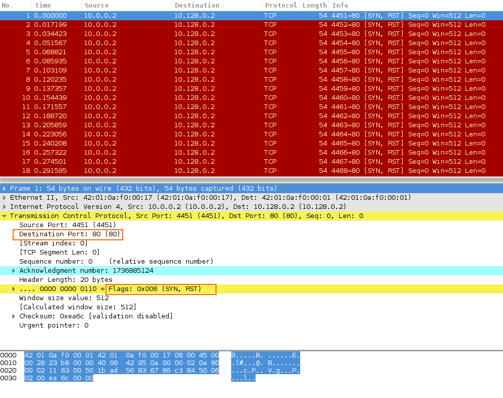

# Analyzing a DoS Attack with Wireshark

## Objective
The objective of this project was to apply practical network security analysis skills by scrutinizing a Denial of Service (DoS) attack. Using Wireshark, I dissected a SYN flood attack to understand its mechanism and its disruptive effects on server communication.

### Skills Learned
- In-depth understanding of DoS attack mechanisms.
- Proficiency in using Wireshark for network traffic analysis.
- Ability to identify abnormal network patterns indicative of a DoS attack.
- Enhanced knowledge of TCP/IP protocols and handshake mechanisms.

### Tools Used
- **Wireshark:** Used for capturing and analyzing SYN flood traffic.

## Steps
*Drag & drop screenshots here or use Imgur and reference them using imgsrc*

Every screenshot should have some text explaining what the screenshot is about.

*Ref 1: SYN flood attack pattern captured in Wireshark*

