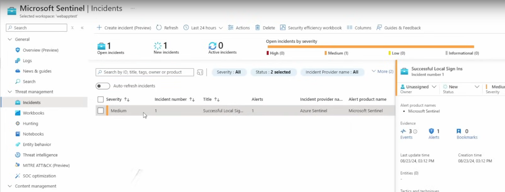

# Building a Security Operations Center (SOC) with Microsoft Sentinel

## Objective

The purpose of this lab was to build a fully operational Security Operations Center (SOC) by deploying a Security Information and Event Management (SIEM) system that monitors and generates alerts for potential security threats across all connected devices. This project involved setting up a virtual machine (VM) in Azure, configuring it for monitoring, deploying Microsoft Sentinel as the SIEM, and integrating threat intelligence feeds to detect and respond to Indicators of Compromise (IOCs).

## Skills Learned

- Proficient in deploying and configuring Microsoft Sentinel as a SIEM solution.
- Experience in integrating VMs with Azure Log Analytics and Sentinel for real-time security monitoring.
- Understanding of configuring Data Connectors and Data Collection Rules in Microsoft Sentinel.
- Ability to create and test custom alert rules to detect specific security events, such as brute-force attacks on RDP.
- Enhanced knowledge of threat intelligence feeds and their integration with SIEM systems for proactive threat detection.

## Tools Used

- **Microsoft Azure:** Cloud platform used to create and manage virtual machines and other resources.
- **Microsoft Sentinel:** Deployed as the SIEM to monitor security events and generate alerts.
- **Azure Log Analytics:** Used for collecting and analyzing logs from various sources.
- **RDP (Remote Desktop Protocol):** Monitored as a potential attack vector for brute-force attacks.
- **Data Connectors:** Specifically, the Windows Security Events connector used to pull event logs into Sentinel.

## Steps

1. **Creating and Configuring the Virtual Machine:**
   - Deployed a Virtual Machine (VM) in Microsoft Azure with RDP inbound ports open, specifically to monitor and simulate RDP-based attacks.
   
2. **Deploying Microsoft Sentinel:**
   - Set up Microsoft Sentinel as the SIEM to monitor security events across the network.
   - Configured a Log Analytics Workspace as the backbone for data collection and analysis.

3. **Connecting the VM to Microsoft Sentinel:**
   - Integrated the VM's event logs with Azure Log Analytics by using the Windows Security Events Data Connector.
   - Created a Data Collection Rule (DCR) to ensure logs from the VM were properly collected and forwarded to the Sentinel instance.

   
   *Ref 1: Log collection configuration in Azure Sentinel*

4. **Configuring Custom Alert Rules:**
   - Developed a custom alert rule in Sentinel to detect successful RDP sign-ins, which could indicate a brute-force attack.
   - The rule was designed to trigger an alert whenever a successful RDP login was detected, providing real-time notifications of potential threats.

   
   *Ref 2: Custom alert rule configuration in Sentinel*

5. **Testing and Simulating the SIEM:**
   - Simulated a brute-force attack by attempting multiple RDP logins on the VM.
   - Verified that the custom alert rule triggered correctly and that logs were continuously collected and analyzed in Sentinel.

   
   *Ref 3: Incident response triggered by successful RDP sign-in*

## Results

- Successfully set up a fully operational SOC with Microsoft Sentinel, capable of monitoring security events, generating alerts, and integrating with threat intelligence feeds.
- The custom alert rule effectively detected brute-force attacks on RDP, allowing for quick incident response.
- Logs from the VM were continuously monitored and analyzed, providing valuable insights into potential security threats.

## Conclusion

This lab project provided hands-on experience in deploying and configuring a SIEM solution using Microsoft Sentinel. The ability to create and test custom alert rules, combined with integrating threat intelligence, demonstrates proficiency in managing and operating a Security Operations Center. This experience is crucial for proactively defending against cyber threats and responding to security incidents.
