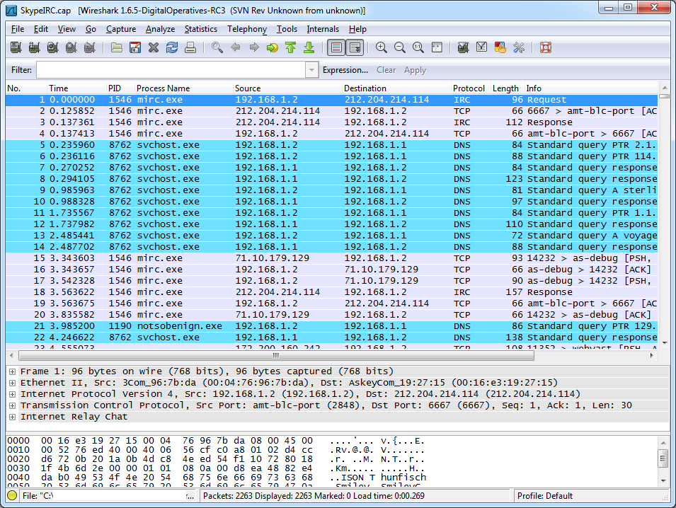

# Network Monitoring and Scanning Project

## Objective
The goal of this project was to develop and execute a network monitoring and scanning system to analyze network traffic, identify devices, and assess network security.

### Skills Learned
- Proficiency in network traffic analysis.
- Ability to identify network vulnerabilities and potential security threats.
- Enhanced understanding of network protocols and services.
- Experience with network scanning and device discovery.

### Tools Used
- **Wireshark:** Captured and analyzed network packets.
- **Nmap:** Performed network scans to discover active devices and open ports.
- **Suricata:** Implemented for real-time network traffic analysis and intrusion detection.

## Steps

### 1. **Setting Up the Environment:**
   - **Objective:** Prepare the network environment for monitoring and scanning.
   - **Action:**
     - Deployed virtual machines (VMs) in a controlled lab environment.
     - Configured the network with multiple devices and varied traffic to simulate a real-world environment.
     - Ensured that all devices were connected to the same network for seamless monitoring.

### 2. **Capturing Network Traffic with Wireshark:**
   - **Objective:** Capture and analyze live network traffic to identify protocols and services in use.
   - **Action:**
     - Launched Wireshark on a monitoring machine.
     - Selected the appropriate network interface to capture all incoming and outgoing traffic.
     - Captured traffic over a specified period, ensuring a variety of protocols were represented (e.g., HTTP, DNS, TCP, etc.).
     - Applied filters to focus on specific types of traffic, such as HTTP requests or DNS queries.
     - Analyzed packet details to understand communication patterns, source/destination IPs, and protocol behavior.
   - **Outcome:** Identified key protocols in use on the network and observed the communication flow between devices.

   
   *Ref 1: Network traffic capture in Wireshark showing TCP and HTTP packets.*

### 3. **Performing Network Scans with Nmap:**
   - **Objective:** Discover active devices and identify open ports/services on the network.
   - **Action:**
     - Ran an initial scan with Nmap to detect all active devices within the network range.
     - Conducted a more detailed scan on selected devices to enumerate open ports and services.
     - Used various Nmap scan types (e.g., SYN scan, UDP scan) to ensure comprehensive coverage.
     - Documented the discovered services and their corresponding versions to assess potential vulnerabilities.
   - **Outcome:** Successfully identified all active devices, open ports, and running services on the network, providing a clear picture of the network's security posture.

### 4. **Implementing Suricata for Intrusion Detection:**
   - **Objective:** Deploy an intrusion detection system (IDS) to monitor real-time traffic for suspicious activities.
   - **Action:**
     - Installed Suricata on a dedicated machine configured to monitor network traffic.
     - Set up Suricata to log and analyze traffic, using predefined rules for detecting known threats.
     - Monitored the live traffic feed from Suricata, observing alerts generated by the IDS.
     - Fine-tuned the rules and configurations to reduce false positives and improve detection accuracy.
   - **Outcome:** Suricata effectively detected and logged several suspicious activities, providing insights into potential intrusion attempts.

### 5. **Analyzing and Reporting:**
   - **Objective:** Compile and analyze the data gathered from the network monitoring and scanning tools.
   - **Action:**
     - Reviewed the logs from Wireshark, Nmap, and Suricata to identify patterns or anomalies.
     - Correlated the findings from different tools to get a comprehensive view of the network’s security posture.
     - Prepared a detailed report documenting the discovered devices, services, potential vulnerabilities, and recommendations for improving network security.
   - **Outcome:** Provided actionable insights into the network’s security vulnerabilities and suggested measures to mitigate identified risks.

## Conclusion

The Network Monitoring and Scanning Project provided practical experience in analyzing network traffic, discovering devices, and assessing the overall security of a network. The use of Wireshark, Nmap, and Suricata enabled a comprehensive approach to understanding the network environment and identifying potential vulnerabilities. The skills and insights gained through this project are essential for maintaining secure and resilient network infrastructures.

