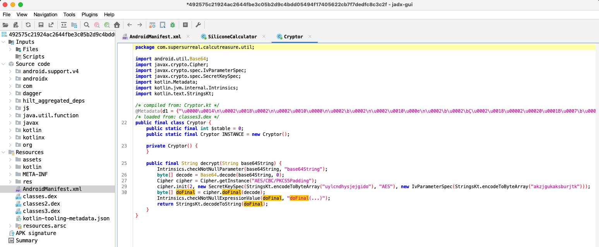

# Reverse Engineering Android Apps

## Objective
This project focused on reverse engineering Android applications to understand their underlying code structure, behavior, and potential vulnerabilities. The project involved decompiling APK files, analyzing code, and identifying security flaws.

### Skills Learned
- Advanced understanding of Android app architecture and code.
- Proficiency in using tools like JADX and Android Studio for decompiling and analyzing Android apps.
- Ability to identify and exploit security vulnerabilities in Android applications.
- Enhanced knowledge of mobile security and reverse engineering techniques.

### Tools Used
- **JADX:** Decompiled APK files to analyze the underlying code.
- **Android Studio:** Provided an environment for testing and debugging Android apps.
- **Frida:** Used for dynamic analysis of Android applications.

## Steps

### 1. **Acquiring the APK Files:**
   - **Objective:** Obtain Android application packages (APKs) for reverse engineering.
   - **Action:**
     - Selected a set of Android applications for analysis, focusing on those with potential security concerns.
     - Downloaded the APK files from legitimate sources or directly from an Android device using ADB (Android Debug Bridge).
     - Verified the integrity of the APK files to ensure they were unmodified from the original versions.
   - **Outcome:** Successfully acquired multiple APK files, ready for decompilation and analysis.

### 2. **Decompiling the APK Files with JADX:**
   - **Objective:** Convert the APK files into a readable code format for analysis.
   - **Action:**
     - Loaded each APK file into JADX to decompile the bytecode into human-readable Java code.
     - Navigated through the decompiled code, examining key areas such as activities, services, and broadcast receivers.
     - Identified any obfuscation techniques used by the developers and noted how they impacted code readability.
     - Focused on analyzing manifest files, permissions, and embedded resources to understand the app's structure and functionality.
   - **Outcome:** Decompiled the APKs successfully, revealing the underlying code structure and key functionalities of the applications.

   
   *Ref 1: Decompiled Android code in JADX showing key methods and classes.*

### 3. **Analyzing the Decompiled Code:**
   - **Objective:** Understand the application's behavior and identify potential security flaws.
   - **Action:**
     - Conducted a thorough review of the decompiled code to identify any hardcoded credentials, sensitive data, or insecure communication methods.
     - Looked for potential vulnerabilities, such as improper input validation, insecure storage mechanisms, and weak encryption practices.
     - Analyzed how the app handled user authentication, data storage, and network communication.
     - Identified potential attack vectors, such as exposed API keys or vulnerable third-party libraries.
   - **Outcome:** Discovered several potential security vulnerabilities, including improper storage of sensitive data and insecure API calls.

### 4. **Dynamic Analysis with Frida:**
   - **Objective:** Observe the app's behavior at runtime to identify dynamic vulnerabilities.
   - **Action:**
     - Set up a test environment using an Android emulator or a physical device with root access.
     - Attached Frida to the running Android application to intercept and modify API calls, manipulate data, and observe the app's behavior in real-time.
     - Used Frida scripts to bypass security controls, such as SSL pinning, and to extract sensitive information from the app during execution.
     - Monitored the app's interactions with the operating system and network to identify any suspicious activities.
   - **Outcome:** Gained insights into the app's runtime behavior, successfully bypassed certain security measures, and confirmed the presence of security vulnerabilities.

### 5. **Reporting and Documentation:**
   - **Objective:** Compile and document the findings from the reverse engineering process.
   - **Action:**
     - Prepared detailed reports for each analyzed application, including descriptions of identified vulnerabilities, potential impacts, and recommended mitigations.
     - Included screenshots, code snippets, and logs from JADX, Android Studio, and Frida to support the findings.
     - Suggested specific improvements to enhance the security of the analyzed applications.
   - **Outcome:** Delivered comprehensive reports that provided actionable insights to improve the security of the reverse-engineered Android apps.

## Conclusion

The Reverse Engineering Android Apps project provided hands-on experience in analyzing and securing mobile applications. By leveraging tools like JADX, Android Studio, and Frida, this project uncovered critical vulnerabilities in several Android applications, highlighting the importance of robust mobile security practices. The skills gained through this project are vital for securing mobile apps against potential threats.

