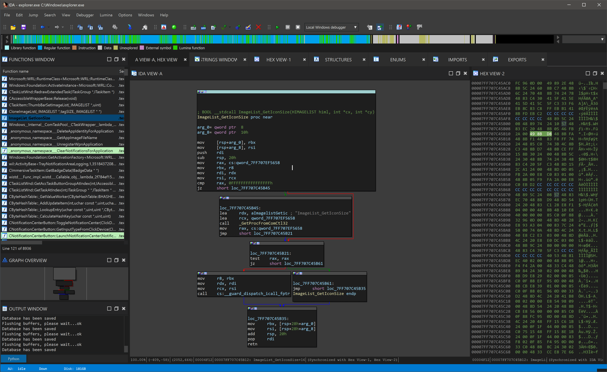
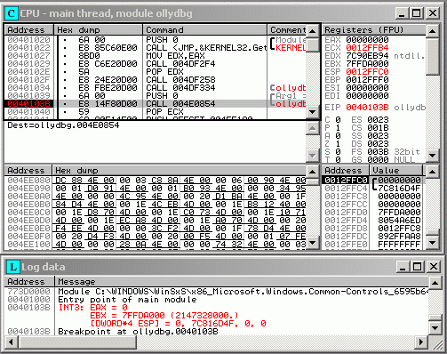
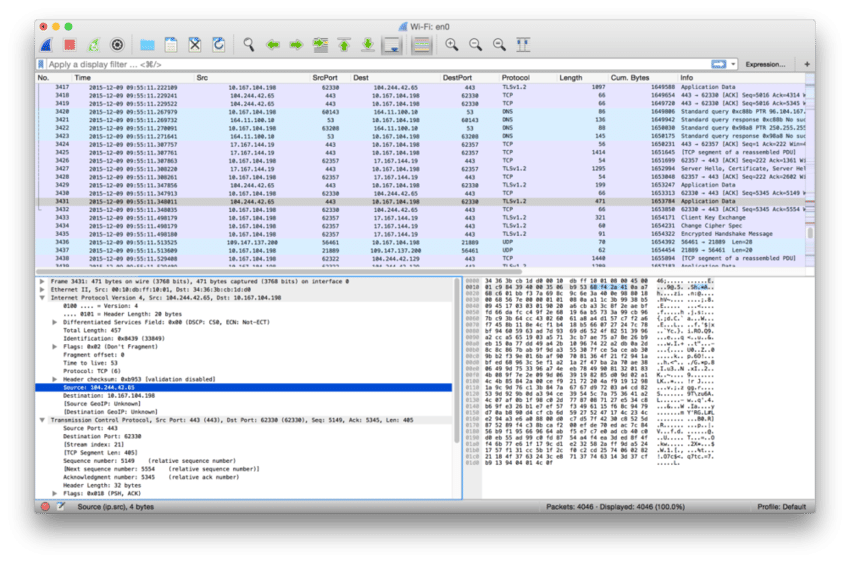

# Reverse Engineering Malware Project

## Objective

This project was undertaken to gain hands-on experience in reverse engineering and analyzing various malware samples to understand their behavior, attack mechanisms, and potential impact on systems. The primary objective was to dissect and interpret the internal workings of different malware families, enhancing both technical and analytical skills in cybersecurity.

## Skills Learned

- **Advanced Reverse Engineering Techniques:** Developed a deep understanding of reverse engineering concepts and their practical applications in real-world scenarios.
- **Proficiency in Disassembly and Debugging:** Gained experience in disassembling and debugging malware binaries using industry-standard tools.
- **Low-Level Code Analysis:** Improved the ability to analyze and interpret low-level assembly code, allowing for a better understanding of how malware operates at a fundamental level.
- **Malware Behavior Analysis:** Enhanced knowledge of various malware behaviors, including infection vectors, persistence mechanisms, and payload delivery methods.
- **Problem-Solving in Cybersecurity:** Strengthened critical thinking and problem-solving skills by analyzing complex malware samples and uncovering their hidden functionalities.

## Tools Used

- **IDA Pro:** Used to disassemble malware binaries, enabling a detailed analysis of the malware’s code structure and functionality. IDA Pro provided an in-depth view of the code, allowing for the identification of key routines and potential exploits.
- **OllyDBG:** Utilized for debugging malware in a controlled environment to observe its runtime behavior. This tool was instrumental in stepping through the code, identifying dynamic changes, and understanding how the malware interacted with system resources.
- **Wireshark:** Employed to monitor network traffic generated by the malware. Wireshark helped in analyzing communication patterns, identifying potential exfiltration attempts, and understanding the network behavior of the malware.
- **Hex Editor:** Used to manually inspect and modify the binary files, providing further insights into obfuscation techniques and encryption used by the malware.

## Malware Samples Analyzed

- **Michelangelo.1:** A DOS-based boot sector virus that activated on March 6th, overwriting the first 100 sectors of the hard disk. Analysis focused on its payload delivery and activation mechanism.
- **DOS-7:** A virus designed to infect DOS executables. The project involved understanding how it replicated itself across systems and the specific conditions under which it triggered its destructive payload.
- **SQLSlammer:** A fast-spreading network worm that targeted SQL servers. The focus was on its method of exploitation and how it spread across networks without writing files to disk.
- **Lucius:** A relatively unknown malware sample analyzed for its unique persistence mechanisms and its ability to evade detection by standard antivirus programs.
- **Harulf:** A trojan that disguised itself as a legitimate application. The analysis included understanding how it captured user credentials and transmitted them to a remote server.

## Steps

1. **Sample Acquisition and Environment Setup:**
   - Collected diverse malware samples from secure sources.
   - Set up an isolated and controlled environment using virtual machines to safely analyze the malware.

2. **Disassembly with IDA Pro:**
   - Loaded each malware sample into IDA Pro to generate disassembly output.
   - Analyzed the code structure, identified key functions, and mapped out the control flow.
   - Identified obfuscation techniques and reverse-engineered them to reveal the original code.

   
*Ref 1: Disassembled code in IDA Pro showing the main function of the Michelangelo.1 virus.*

3. **Debugging with OllyDBG:**
   - Executed the malware in a controlled environment while using OllyDBG to step through the code.
   - Observed how the malware altered system states, interacted with files, and modified registry settings.
   - Detected anti-debugging techniques and bypassed them to continue the analysis.

   

   *Ref 2: Debugging session in OllyDBG revealing a breakpoint at the entry point of the DOS-7 virus.*

5. **Network Traffic Analysis with Wireshark:**
   - Monitored network traffic generated by each malware sample using Wireshark.
   - Identified unusual communication patterns, including attempts to contact command-and-control servers.
   - Captured and analyzed data packets to understand how the malware transmitted information over the network.

     
*Ref 3: Network traffic captured by Wireshark showing data exfiltration attempts by the Harulf trojan.*

6. **Report and Documentation:**
   - Documented the findings for each malware sample, including detailed reports on behavior, potential impacts, and mitigation strategies.
   - Compiled the analysis into a comprehensive report, including screenshots, code snippets, and network diagrams.

## Results

- **Michelangelo.1:** Identified the trigger mechanism and the exact sectors overwritten by the payload.
- **DOS-7:** Detailed the virus replication method and how it avoided detection by simple file integrity checks.
- **SQLSlammer:** Explained the rapid propagation technique and how it exploited SQL server vulnerabilities.
- **Lucius:** Uncovered the persistence mechanism and the novel techniques it used to remain undetected.
- **Harulf:** Analyzed the trojan’s method for capturing and exfiltrating sensitive information, leading to recommendations for detection and prevention.

## Conclusion

This reverse engineering malware project provided invaluable hands-on experience with some of the most powerful tools and techniques in the field of cybersecurity. By dissecting and analyzing real-world malware samples, I developed a deeper understanding of how malicious software operates and how to effectively combat it. This project not only improved my technical skills but also prepared me to tackle complex cybersecurity challenges in the future.

